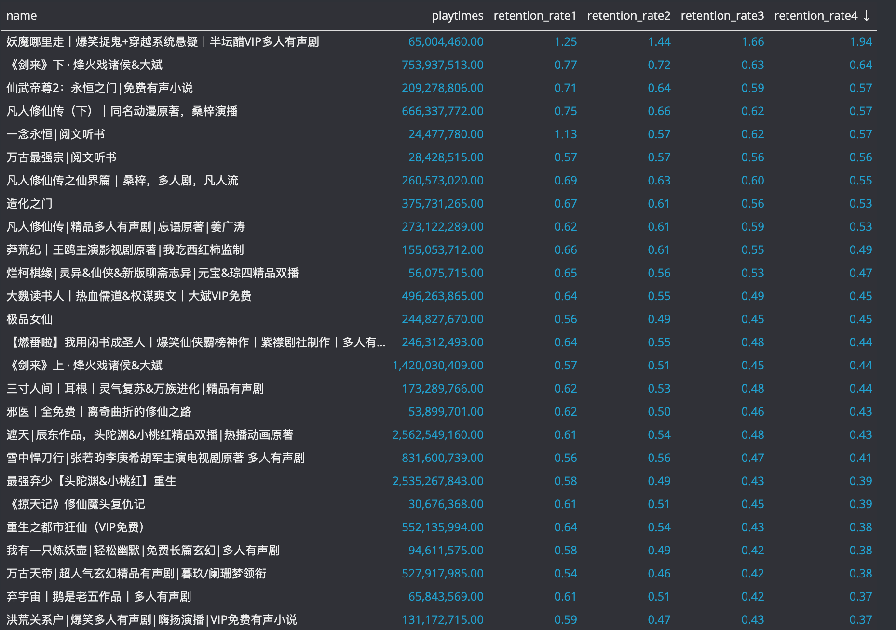

# ximalaya_top
为了在 喜马拉雅 中找到好的作品

## 原因
目前喜马拉雅上刷榜的情况太多，导致只看作品评分，并不能看出作品的好坏，所以需要一个工具来帮助筛选出好的作品。

## 初步思路
通过爬虫获取喜马拉雅的作品信息。
然后尝试通过一些不容易刷的指标来筛选出好的作品。

1、作品的留存率，即第101~200集播放次数/1~100集播放次数，后面还可以加上201~300集播放次数/1~100集播放次数，以此类推。

2、评论过滤，排除掉刷榜的评论，这个暂时想法还不是很成熟，比如将没有任何留言只有评分的评论过滤掉。目前考虑甚至把满分的评论也全部去掉。我觉得满分就是有可能是刷榜的，而其他分数应该也有一定程度的反应作品的好坏。

## 初步结果
我找了男频>仙侠 品类的前100个作品，做了留存率的统计，计算了201~300/1~100,301~400/1~100,401~500/1~100,501~600/1~100 共4个留存率，然后按照501~600/1~100做降序排列，得到下面结论，看起来还可以，蛮符合我的主管直觉。

